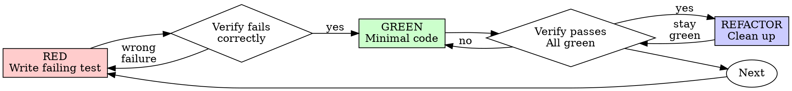

# Test-Driven Development (TDD)

## What this skill owns

This is a *technique* guide: how to do red-green-refactor well when a test is
warranted, and where it genuinely pays off. It does not decide *whether* a
task needs a test first — that call belongs to `standards/AGENTS.md`'s
Testing section: non-trivial logic (a branch, a loop, a parser, a
money/security path) ships one runnable check; trivial one-liners don't need
one. Don't relitigate that threshold here.

**Core principle:** if you didn't watch the test fail, you don't know it
tests the right thing. That's the reason test-first beats test-after even
when both end up "covering" the same line — a test-after pass proves nothing
about whether the test would catch a real regression.

## Red-Green-Refactor



### RED — Write one failing test

One behavior, a clear name, real code — not a mock standing in for the thing under test.

<Good>
```typescript
test('retries failed operations 3 times', async () => {
  let attempts = 0;
  const operation = () => {
    attempts++;
    if (attempts < 3) throw new Error('fail');
    return 'success';
  };

  const result = await retryOperation(operation);

  expect(result).toBe('success');
  expect(attempts).toBe(3);
});
```
</Good>

<Bad>
```typescript
test('retry works', async () => {
  const mock = jest.fn()
    .mockRejectedValueOnce(new Error())
    .mockRejectedValueOnce(new Error())
    .mockResolvedValueOnce('success');
  await retryOperation(mock);
  expect(mock).toHaveBeenCalledTimes(3);
});
```
Tests the mock's call count, not the retry behavior.
</Bad>

### Verify RED — watch it fail, for the right reason

Run it. Confirm it fails (not errors), and the failure is because the feature
is missing — not a typo in the test. A test that passes immediately is
testing existing behavior; fix the test before writing any code.

### GREEN — minimal code to pass

```typescript
async function retryOperation<T>(fn: () => Promise<T>): Promise<T> {
  for (let i = 0; i < 3; i++) {
    try {
      return await fn();
    } catch (e) {
      if (i === 2) throw e;
    }
  }
  throw new Error('unreachable');
}
```

Don't add options, refactor unrelated code, or generalize beyond the test
that's currently red. `maxRetries`/`backoff`/`onRetry` params nobody asked
for are YAGNI, not thoroughness.

### Verify GREEN — watch it pass, check nothing else broke

Confirm the new test passes and the rest of the suite is still green. If the
new test fails, fix the code. If an old test breaks, fix that now, not later.

### REFACTOR — clean up while green

Remove duplication, improve names, extract helpers. Don't add behavior here —
if you need a new case, that's a new RED.

## Where TDD pays off most

Parsers, state machines, retry/backoff logic, money and auth paths, anything
with a branch a reviewer would ask "what if the input is empty/negative/huge"
about. Writing the test first here forces you to state the contract before
the implementation biases what you check.

## When stuck

| Problem | Likely cause |
|---------|--------------|
| Don't know how to test it | Write the API you wish existed, then the assertion, before the implementation. |
| Test setup is huge | The design is too coupled — extract a helper, or simplify the interface. |
| Must mock everything to test it | The code is too coupled to its dependencies — inject them instead. |
| Test passed on the first try | You're testing something that already works, or the test isn't exercising the new code path. |

See [writing-good-tests.md](writing-good-tests.md) for the rules that keep
tests honest once they're green: name the production change that would break
the test, assert on real behavior not mock calls, and understand a
dependency's side effects before mocking it.
